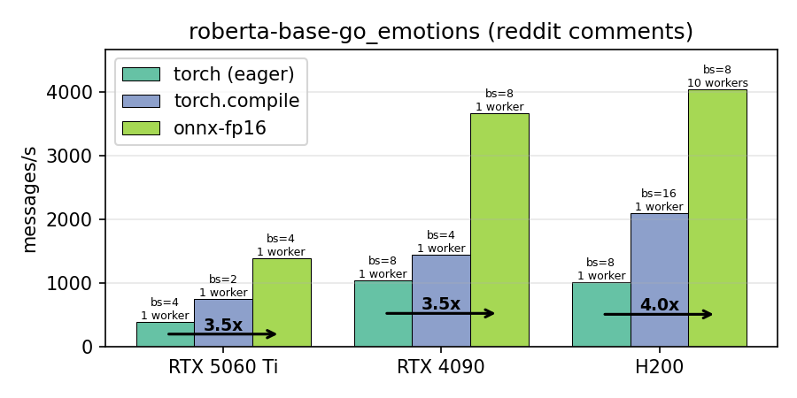
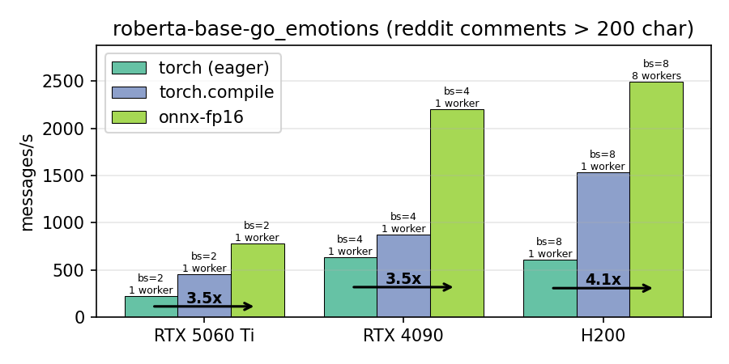

## Encoder Optimizations with ONNX

Many transformers encoder-type models can have considerably performance gains by being converted to [ONNX](https://onnx.ai/). Some model families (`BERT`, `RoBERTa`, etc) can be further quantized to ONNX-FP16 for **2-4X performance gains** with no accuracy penalty. This repo contain scripts to convert, validate accuracy and benchmark models.

A collection of pre-converted models, with their accuracy metrics, can be found here: https://huggingface.co/collections/joaopn/onnx-fp16

## Benchmark

GPU Benchmark of the [`SamLowe/roberta-base-go_emotions`](https://huggingface.co/SamLowe/roberta-base-go_emotions) model on two datasets of 10k reddit comments, one random and one filtered to comments with >200 char. The full dataset is pre-tokenized, and dispatched to a varying number of GPU workers with varying batch sizes. The figures below represent the best combination (check `results/` for the full data). On the normal dataset, the ONNX-FP16 version ([`joaopn/roberta-base-go_emotions-onnx-fp16`](https://huggingface.co/joaopn/roberta-base-go_emotions-onnx-fp16)) had a mean label probability difference from the original version of `0.00119459` and a max of `0.02122244`, across all labels.

### Results
- The ONNX-FP16 model is **3-4X** faster than base `torch`, **~2X** faster than `torch.compile`
- With the top-end cards, the model hits the CPU dispatch rate bottleneck: the H200 is barely faster than the RTX 4090 despite much higher specs, even with multiple parallel workers

<p align="center">
  
</p>

<p align="center">
  
</p>

### Usage

#### Requirements

ONNX with CUDA requires a working `torch` installation with CUDA support, as well as `transformers`, `optimum`, `pandas` and `tqdm`. These can be installed with

```
pip install transformers optimum[onnxruntime-gpu] pandas tqdm --extra-index-url https://aiinfra.pkgs.visualstudio.com/PublicPackages/_packaging/onnxruntime-cuda-12/pypi/simple/
```

Alternatively, a conda environment `bench` with CUDA 12.8 and all the requirements can be created with

```
conda env create -f environment.yml
conda activate bench
```

#### Dataset

The dataset consists of 10k randomly sampled Reddit comments from 12/2005-03/2023, from the [Pushshift data dumps](https://academictorrents.com/details/9c263fc85366c1ef8f5bb9da0203f4c8c8db75f4). It excludes comments with empty, `[deleted]` or `[removed]` content. Two options are provided:
- `normal`: As described above
- `filtered`: contains only comments with `>200` characters. 


To run the benchmarks, use the `run_benchmark.py` script:

```
python run_benchmark.py --model [torch, onnx or onnx-fp16] --device [gpu or cpu]
```

Arguments:
- `model` (required): Model backend to use, either "torch" for torch or "onnx" for ONNX Runtime.
- `device` (required): Device type to use, either "gpu" or "cpu"
- `dataset`: Dataset variant to use, either "normal" or "filtered" (default: "normal").
- `gpu`: ID of the GPU to use (default: 0).
- `batches`: Comma-separated batch sizes to run (default: "1,2,4,8,16,32").
- `threads`: Specify the number of CPU threads to use (default: 1).


The scripts will output the number of messages processed per second for each batch size.

## Model Export

To export and optimize a HuggingFace model to ONNX FP16 format, use the `export_onnx.py` script:

```
python export_onnx.py <model_id> [OPTIONS]
```

This script:
1. Exports a HuggingFace model to ONNX with FP16 optimization (O4 config)
2. Benchmarks it against the original PyTorch model on 10k Reddit comments
3. Generates a README with accuracy statistics
4. Optionally uploads the optimized model to HuggingFace Hub

Arguments:
- `model_id` (required): HuggingFace model ID (e.g., "SamLowe/roberta-base-go_emotions")
- `--save-dir`: Directory to save the optimized model (default: "./{model_name}-onnx-fp16")
- `--batch-size`: Batch size for benchmarking (default: 1)
- `--hf-token`: HuggingFace API token for upload
- `--no-upload`: Skip the upload prompt and don't upload to HuggingFace
- `--disable-shape-inference`: Disable shape inference during optimization (recommended for very large models)